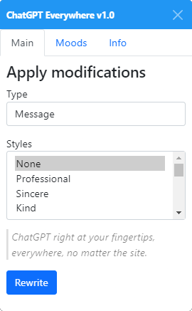

# ChatGPT Everywhere

ChatGPT right at your fingertips, everywhere, no matter the site. Simply highlight any text on a page. Before letting go of your mouse button, hold it for 1 second and ChatGPT Eveywhere should appear. Have fun!

### [[Install]](https://github.com/Hakorr/Userscripts/raw/main/OpenAI.com/ChatGPTEverywhere/chatgpteverywhere.user.js)

## Tested sites

| Service       | Site content [(?)](## "Any text on the page") | Message box [(?)](## "Text boxes you can write to") |
|-------------|--------------|-------------|
| Twitter | ✔️ | ❌ |
| Reddit | ✔️ | ✔️ |
| Discord | ✔️ | ❌ |
| Github  | ✔️ | ✔️ |
| Gmail  | ✔️ | ✔️ |
| Outlook  | ✔️ | ✔️ |
| Protonmail  | ✔️ | ❌ |

#### Legend

✔️ = Rewritable
❌ = Rewriting does not work

## Q&A

### How to install & use?

1. Install a [Userscript Manager](https://violentmonkey.github.io/).
2. Install [ChatGPT Everywhere](https://github.com/Hakorr/Userscripts/raw/main/OpenAI.com/ChatGPTEverywhere/chatgpteverywhere.user.js).
4. Set your [OpenAI API Key](https://beta.openai.com/account/api-keys) on the userscript's settings. The settings are located at the top of the userscript's source code.
5. Simply highlight any text on a page. Before letting go of your mouse button, hold it for 1 second and a GUI should appear.

### How to edit the settings?

1. Locate your browser's extensions on the top right corner.
2. Click on your userscript manager.
3. Right click the ChatGPT Everywhere userscript. (Could vary from manager to manager)
4. A source code editor should open up. You should see the settings on the top of the source code.

### Why would I use this?

- Make more compelling arguments.
- Sound wiser, smarter or dumber.
- Make an impression on someone, be it your client, boss, or crush.

### Everywhere?

Yes, hopefully. Discord, Reddit, Gmail, Github... you name it!

### It doesn't work / the rewritten text disappears

Some sites might have unique elements and situations which couldn't be tested for. The script will not work on those sites unless the bug is reported and the userscript updated to support that specific site.

If your text is replaced by the site, you can manually copy the rewritten text from the GUI. Modern website frameworks like React don't always notice programmically modified textfields, and replace the field's contents with whatever they last had.

## Examples of Rewritten "Hello world"

| Applied styles                | Input        | Output                                                                                                                                                                                                                                           |
|-------------------------------|--------------|--------------------------------------------------------------------------------------------------------------------------------------------------------------------------------------------------------------------------------------------------|
| None                          | Hello world! | Hello world!                                                                                                                                                                                                                                     |
| Professional                  | Hello world! | Hello,  I am pleased to introduce myself to the world.  Best,  [Name]                                                                                                                                                                          |
| Professional, Angry           | Hello world! | Dear World,  I am disappointed with how things are going. We need to take immediate action to make things right. Let's start now.  Sincerely, [Your Name]                                                                                        |
| Professional, Melancholy      | Hello world! | Welcome to this dismal existence; we hope you find peace and solace amidst the chaos.  We regret to inform you that this world can often be a place of despair. We hope, however, that you may find solace and comfort amongst the difficulties. |
| Philosophical, Dreamy, Loving | Hello world! | Hello world! Let us dream of a brighter tomorrow and discover the love that we have for our world and the people living in it. Let us shine the light of change together and find harmony that surpasses both space and time.                    |

## ⚠️ Fair Warning

Please do not use this script for any events of importance. The script can fail to properly edit the contents, which may cause you to send a message which is not actually rewritten. This script shall not be held accountable for anything.
