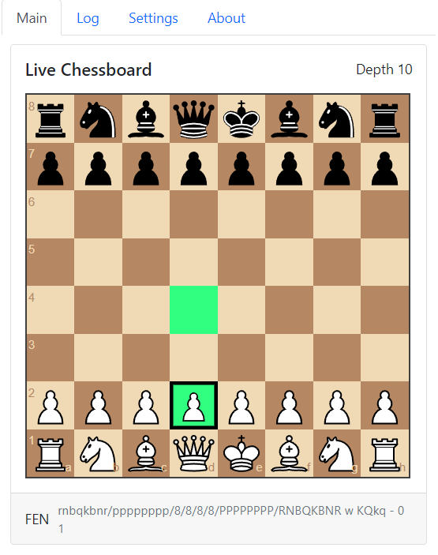

# [A.C.A.S (Advanced Chess Assistance System)](https://greasyfork.org/en/scripts/459137-a-c-a-s-advanced-chess-assistance-system)

A.C.A.S is an advanced chess assistance system which enhances your chess performance with cutting-edge real-time move analysis. Just install the userscript and you're good to go! No installations needed.

### [[Install]](https://github.com/Hakorr/Userscripts/raw/main/Other/A.C.A.S/acas.user.js)

# Q&A

### Can A.C.A.S beat the hardest bots like Mittens?

Of course, with enough time and attempts. Keep in mind that A.C.A.S uses the Lozza chess engine, which uses JavaScript and runs on your browser. The engine is really slow compared to the best chess engines, so it's not in your best interest to play against Mittens and other very hard bots.

### Why am I losing to the hardest bots?

Because A.C.A.S is not intended to be used against the hardest bots. A.C.A.S runs on your browser, so it's slow and grumpy.

### Why doesn't it work?

It could be a bug, please make an issue [here](https://github.com/Hakorr/Userscripts/issues).

# Examples

