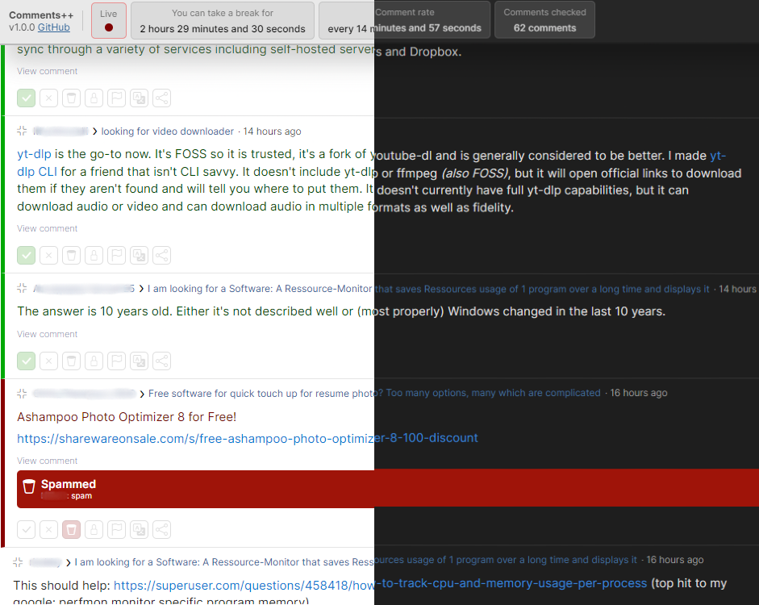

# [Reddit] Comments++

Enables a live-feed for subreddit comments, and various other things!

### [[Install]](https://github.com/Hakorr/Userscripts/raw/main/Reddit.com/CommentsPlusPlus/commentsplusplus.user.js)

## Features

- Live subreddit comment feed
- Adds a visible marker to the feed to indicate where you left after changing tabs
- Image links shown as actual images
- Comments automatically update on hover
- Calculates and tells the moderator their optimal break time
- Keep track on how many comments the moderator has seen
- Improved comment UI, less clutter, better visibility
- New comment notifications/sounds
- Hide Reddit sidebar and other Reddit UI to bring focus to the comments
- Dark theme for less strain on your eyes
- Load more comments button, no need to switch pages
- Easy language translate button
- Ability to see deleted content after the user has deleted the comment
- Various other changes and improvements

## How to use?

1) Install [a userscript manager](https://violentmonkey.github.io/)
2) Install [the script](https://github.com/Hakorr/Userscripts/raw/main/Reddit.com/CommentsPlusPlus/commentsplusplus.user.js)
3) Head to `https://www.reddit.com/r/subreddit/comments/` (change the subreddit to yours)
4) Enjoy!

## Preview

**Made with ❤️ for moderators, by a moderator!**
