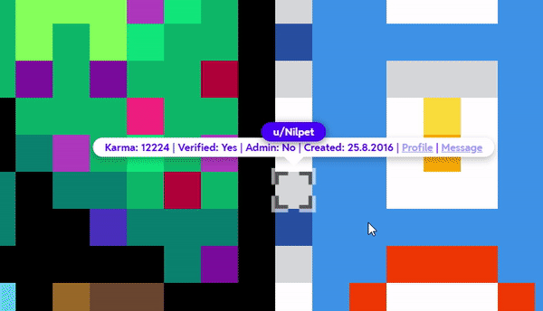

# [Reddit r/Place] ExtraUserInformation
Adds additional info about the user to the usertag

## Tips

* Use MMB (Middle Mouse Button) to open links, this way it opens without disturbing the Reddit's UI

# [Install](https://github.com/Hakorr/Userscripts/raw/main/Reddit.com/PlaceExtraUserInfo/placeextrauserinfo.user.js)

